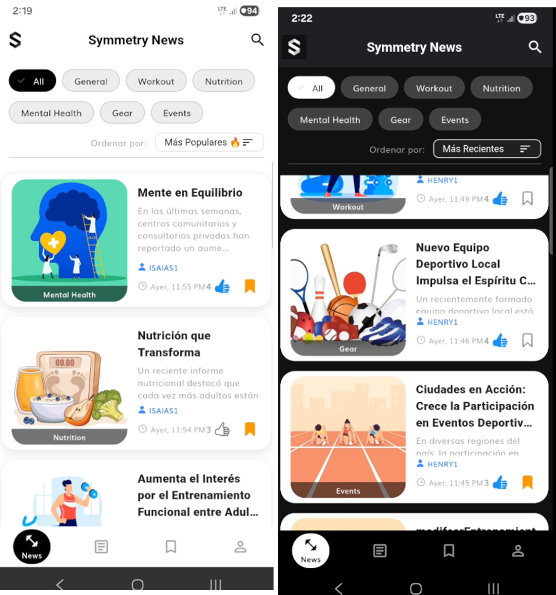
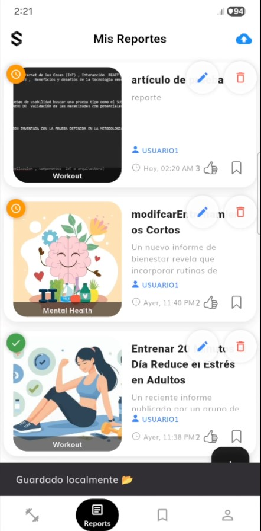
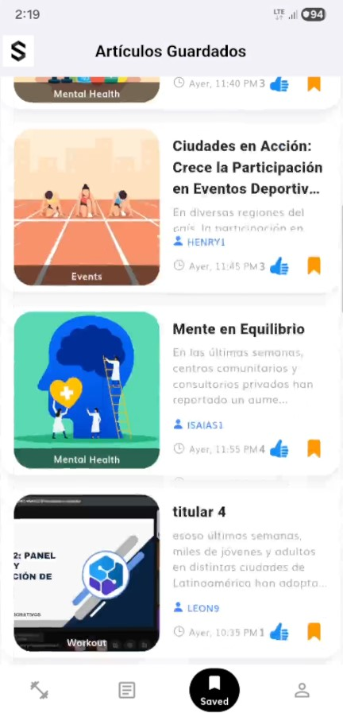
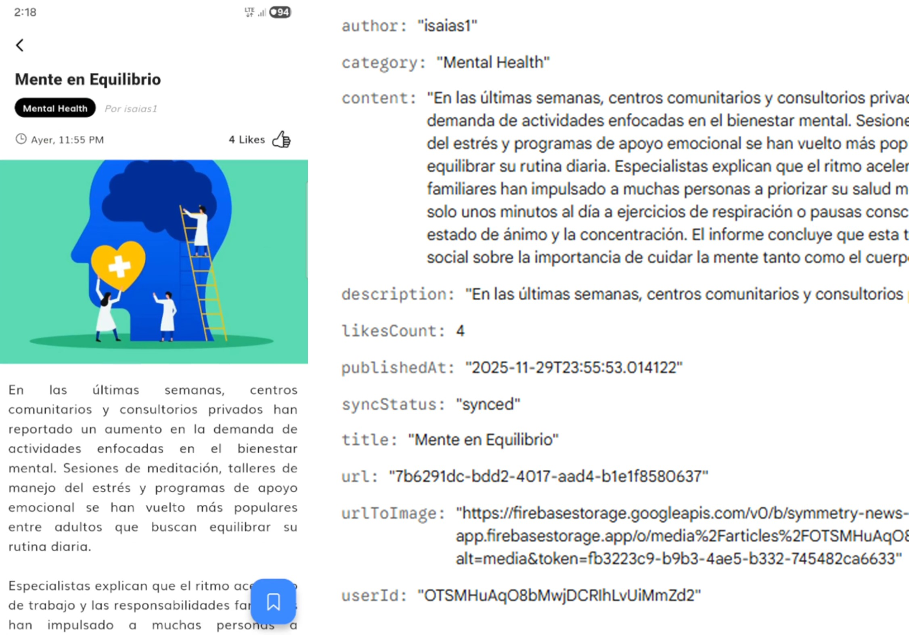
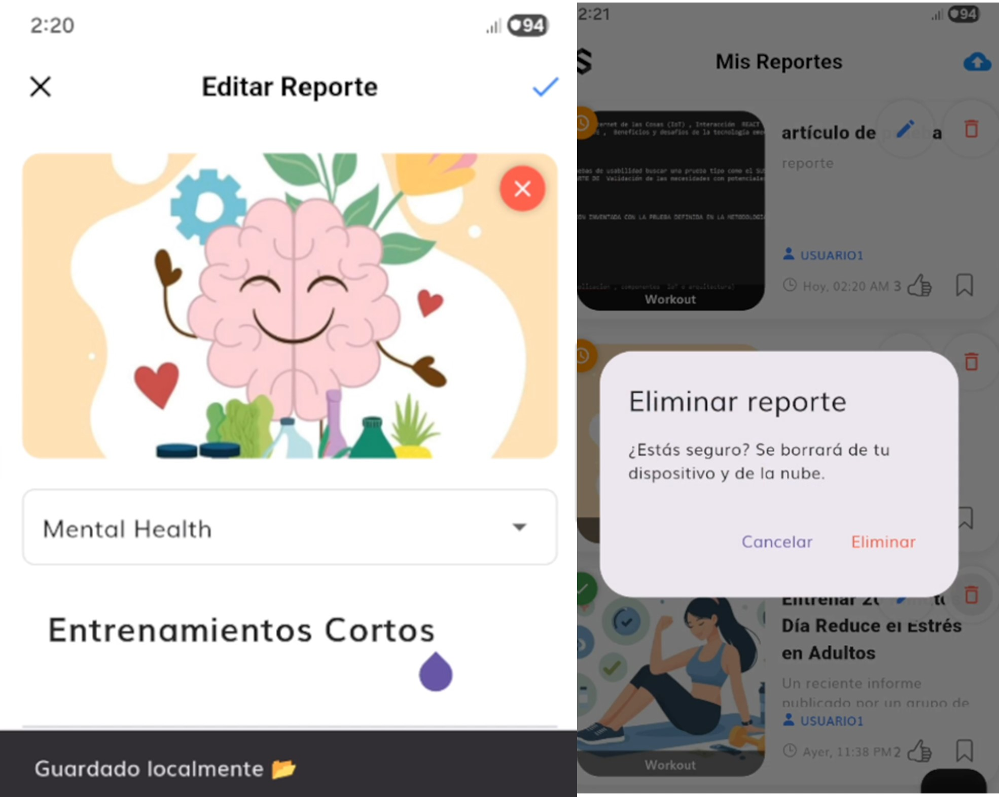
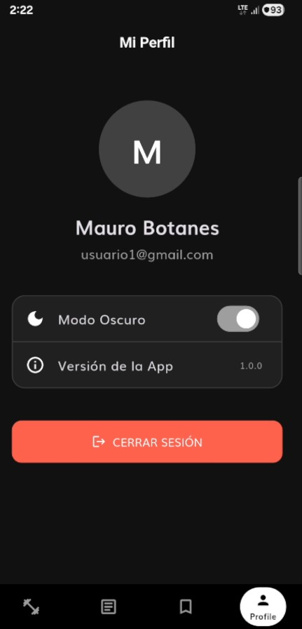

# Symmetry Applicant Showcase: Final Report

**Applicant:** Henry Galvez
**Role:** Frontend & Mobile Developer | UX/UI Specialist
**Date:** November 2025

---

## 1. Introduction

When I received the Symmetry challenge, I recognized immediately that this was not a standard "coding test." [cite_start]It was a request for engineering excellence[cite: 383, 384]. As a Systems Engineering student ranked in the top tier of my class (*Quinto Superior*) and a finalist in national cybersecurity and innovation tournaments, I thrive on challenges that require merging scalable architecture with intuitive user experiences.

My approach was to treat this project as a Minimum Viable Product (MVP) for a real-world production environment. I leveraged my background in UX/UI (Certified by Coderhouse) to ensure the interface was not only functional but polished, while my engineering background drove the robust, **"Offline-First" architecture** that lies beneath the surface.

[cite_start]This report documents the journey of building a system designed to work seamlessly, regardless of internet connectivity, fulfilling the "Maximally Overdeliver" core value[cite: 400].

---

## 2. Learning Journey

[cite_start]While I possess experience with Flutter and Clean Architecture, this project pushed me to strictly adhere to **Symmetry's Architectural Guidelines**[cite: 507].

* **Strict Clean Architecture:** I enforced a rigid separation of concerns. [cite_start]The *Domain* layer remains pure Dart[cite: 583], completely agnostic of the *Data* (Firebase/Floor) and *Presentation* (Flutter) layers. This discipline ensured that the business logic is testable and maintainable.
* **BLoC Pattern & Streams:** I deepened my understanding of reactive programming. Managing the authentication state via Streams and orchestrating the "Global Switch" for Bookmarks across different BLoCs required a mastery of asynchronous data flow.
* [cite_start]**Floor & SQLite:** I explored advanced relational mapping for Flutter, implementing complex queries to handle the local persistence required for the offline-first strategy[cite: 373].

---

## 3. Challenges Faced

The requirement to build a robust "Offline-First" app introduced significant engineering challenges that went beyond simple CRUD operations.

### 3.1. The "Race Condition" in Synchronization
**Challenge:** When a user opens the app, the system tries to download updates from the cloud (Pull). Simultaneously, if the user modifies data locally (Push), a race condition occurs where local changes could be overwritten by stale remote data or duplicate entries could be created.
**Solution:** I implemented a **Mutex Lock (Semaphore)** pattern in the `ArticleRepositoryImpl`. A boolean flag `_isSyncing` prevents overlapping sync processes. [cite_start]Furthermore, I implemented a "State Merging" strategy: before inserting remote data, the repository checks the local database to preserve user-generated states like `isSaved` or `isLiked` that haven't synced yet[cite: 1052].

### 3.2. Soft Deletes in an Offline Environment
**Challenge:** If a user deletes an article while offline, we cannot simply remove the row from the local database, or the next sync would re-download it from the cloud (since it still exists there).
[cite_start]**Solution:** I implemented a **Soft Delete** mechanism[cite: 1063].
1.  **Local:** The item is marked with `syncStatus = 'pending_delete'`.
2.  **DAO Filter:** The `ArticleDao` filters these items out of UI queries immediately, making the deletion appear instant to the user.
3.  **SyncWorker:** When connectivity is restored, the worker detects this flag, deletes the resource in Firebase (Storage + Firestore), and finally wipes the local record.

### 3.3. Cloud Interactions (Likes & Saved)
**Challenge:** Persisting "Likes" and "Saved Articles" across devices while maintaining offline capabilities.
[cite_start]**Solution:** I created specific sub-collections in Firestore (`users/{uid}/saved_articles` and `liked_articles`)[cite: 362, 363]. The local database acts as the single source of truth for the UI, providing an "Optimistic UI" update (instant feedback), while the repository handles the background synchronization to the cloud when internet is available.

---

## 4. Reflection and Future Directions

This project confirmed my belief that a great UI is nothing without a solid architecture. The "Offline-First" approach transforms the user experience, making the app feel incredibly fast and reliable.

**Future Improvements:**
* **Unit Testing:** Due to the strict time constraints and the strategic prioritization of complex feature delivery (Sync Engine, Dark Mode), Unit Tests (Task 12.1) were omitted. In a production environment, I would add tests for the `UseCases` and `BLoCs` using `mockito` and `bloc_test` to ensure regression safety.
* **CI/CD:** Implementing GitHub Actions to automate the build and deployment process to Firebase App Distribution.

---

## 5. Proof of Project

### 5.1. Video Demonstration
> *[Insert Video Link Here - Demonstrating Offline Creation, Auto-Sync when internet returns, and Dark Mode]*

### 5.2. Screenshots

The following screenshots demonstrate the UI polish and key functionalities.

| **Feed (Light vs Dark Mode)** | **Offline Sync Indicators** |
|:---:|:---:|
|  |  |
| *Adaptive OLED Dark Mode* | *Orange (Pending) vs Green (Synced)* |

| **Interactions: Likes & Saved** | **Hybrid Image Rendering** |
|:---:|:---:|
|  |  |
| *Persisted State across App Restarts* | *Local File vs Remote URL* |

| **Create & Edit Reports** | **Profile & Theming** |
|:---:|:---:|
|  |  |
| *Form Validation & Image Picker* | *Theme Switcher & Logout* |

---

## 6. Overdelivery (Maximally Overdeliver)

[cite_start]In alignment with Symmetry's third value[cite: 400], I went beyond the functional requirements to deliver superior engineering and UX.

### 6.1. True "Store-and-Forward" Sync Engine
Instead of simple caching, I built a bidirectional synchronization engine.
* **Logic:** `Local Write (Pending) -> Background Sync -> Cloud Write -> Local Update (Synced)`.
* **Upsert Strategy:** The system uses `SetOptions(merge: true)` in Firestore to allow editing articles offline without overwriting other fields.
* [cite_start]**Auto-Sync:** Integrated `connectivity_plus` and `useEffect` hooks to trigger synchronization automatically when the network is restored or the app is opened[cite: 1075].

### 6.2. Advanced Dark Mode Architecture
I didn't just invert colors; [cite_start]I implemented a full **Theming System**[cite: 1122].
* **Persistence:** A `ThemeCubit` persists the user's preference in `SharedPreferences`.
* **Adaptive Branding:** Created a `SymmetryAppLogo` widget that intelligently switches between black and white assets based on the active theme context.

### 6.3. In-Memory Search & Filtering
[cite_start]The original requirement was simple, but I implemented a robust **Discovery Engine**[cite: 1082].
* **Performance:** Instead of hitting the database for every search query, I implemented an in-memory filtering logic within the `RemoteArticlesBloc`.
* **Filters:** Added support for filtering by **Category**, **Author**, or **Content**, and sorting by **Date** or **Popularity (Likes)**. This works instantly, even for "Guest" users without a local database.

### 6.4. Data Isolation & Security
To ensure privacy in a shared device environment:
* **Row-Level Security:** Modified the SQLite Schema to include `userId`. [cite_start]The DAO strictly filters `WHERE userId = :uid`[cite: 1004].
* **Session Lifecycle:** Implemented a `ClearLocalDataUseCase` that wipes sensitive user data from the device upon Logout, preventing data leaks between sessions.

---

*This project represents my commitment to Truth, Accountability, and Excellence. I am ready to bring this level of dedication to the Symmetry team.*